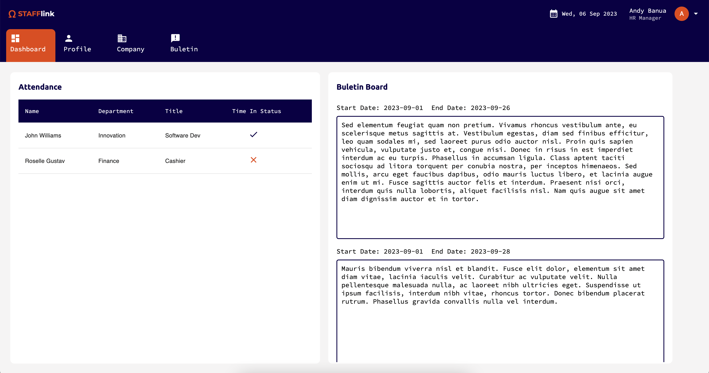

# Stafflink: HR Management App
#### Video Demo:  <URL HERE>
#### Description:
Stafflink is a Full Stack Web App Project that was made for the PSET 10 of Harvard CS50 Course. It is an HR Management App designed for simplicity and reliability due to it's straightforward UI.



#### Features:

##### Dashboard:
- Time in feature for employees
- Track employees' attendance for HRs
- View Company's announcements

##### Profile:
- Profile details
- Editable Profile details

#### Company Management:
- Bird's eye view for your company's employees
- Add/Update/Delete employees
- Company details
- Editable Company details

#### Buletin Board:
- Date based Announcements
- View Company's Announcements
- Add and Delete Company's Announcements

### Installation:

To install Stafflink to your local machine:

1. Clone the repo to your local machine:
```
git clone https://github.com/andyfeated/stafflink-mono
```

2. Install the dependencies
```
cd server
npm install

cd ../client
npm install
```

3. Add the .env files
```
NEXT_PUBLIC_LOCAL_SERVER_BASE_URL=http://localhost:3100 // for client/.env.local
JWT_SECRET=changeme // for server/.env
```

4. Start the application
```
npm run dev:server
npm run dev:client
```